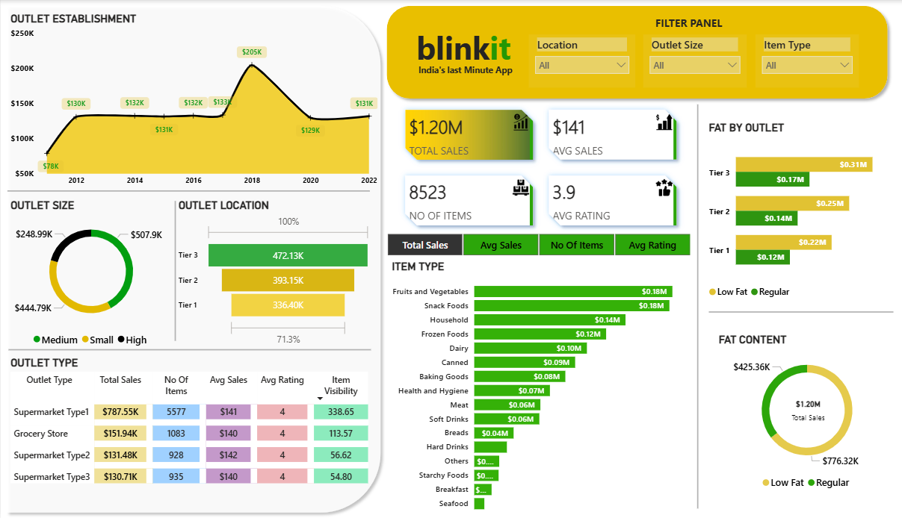

# Blinkit Data Analytics Project 📊  

## 📌 Project Overview  
This project analyzes **Blinkit’s business performance** using SQL and Power BI.  
The goal is to uncover insights on **sales trends, customer behavior, and product performance**, and present them in an interactive dashboard.  

---

## 🛠️ Tools & Technologies Used  
- **SQL** → Data extraction & transformation  
- **Power BI** → Data visualization & dashboarding  
- **Excel/CSV** → Data source  

---

## 📊 Dashboard Preview  
Main Dashboard:  

---

## 📑 SQL Queries  
The SQL queries used for cleaning, transforming, and analyzing data are available [here](Data_Analysis/SQL_Query/BlinkIt_SQL_query.sql).  

---

## 📑 SQL Queries 

The detailed explanation for the sql is [Here](Data_Analysis/SQL_Query/Sql_script.txt)

---

  📈 Key Insights

Top-performing products and categories

Customer purchasing patterns

Revenue trends over time

Business KPIs for decision-making

🔮 Future Improvements

Automating data refresh with SQL Server

Adding predictive analytics for sales forecasting

Enhancing dashboard with more drill-through analysis

👤 Author : Tejaswi R

📧 Email: tejaswi.r.2021.cce@ritchennai.edu.in

🔗 LinkedIn:

 | GitHub
